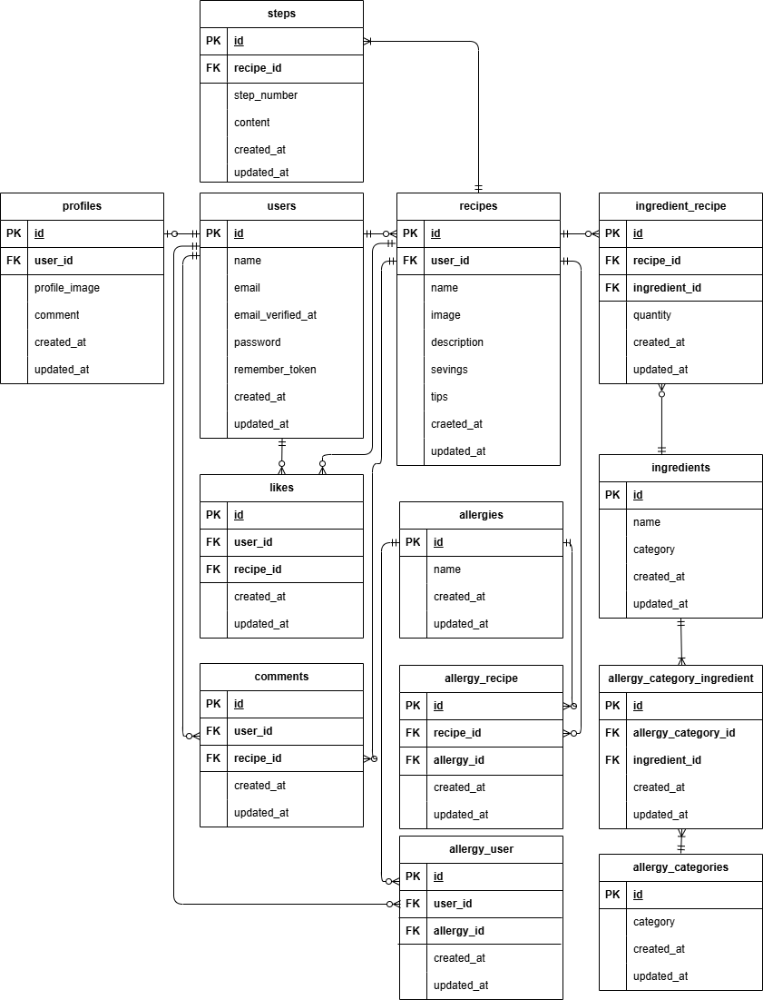

# Allerfree Kitchen

## アプリ概要
本アプリは食物アレルギーを持つ子供を育てる親御さん向けに特化したレシピ投稿・検索プラットフォームです。
レシピ投稿時にアレルギー品目を明示的にタグ付けすることで、ユーザーが特定のアレルギー品目を含まないレシピを安全に検索・発見できる仕組みを提供します。

## 使用技術

- バックエンド： PHP 8.5.6, Laravel 10.50.2
- フロントエンド：
- データベース： MySQL 8.4.9
- 開発環境： Docker, Laravel Sail, phpMyAdmin

## 環境構築
(後で記載)

## ER 図

## 機能一覧
（後で記載）