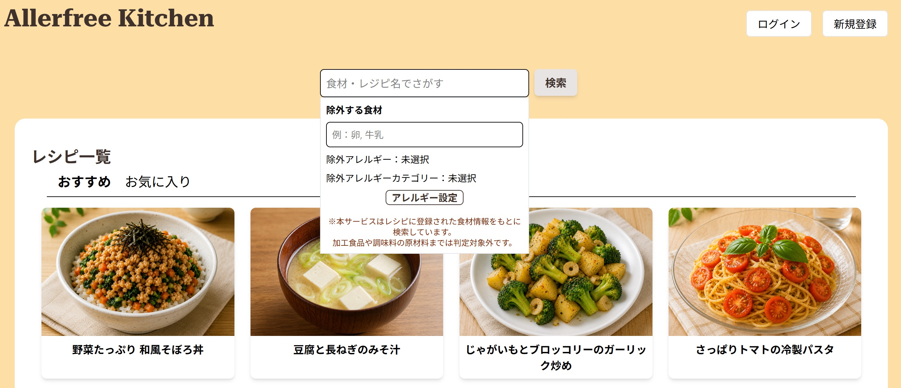
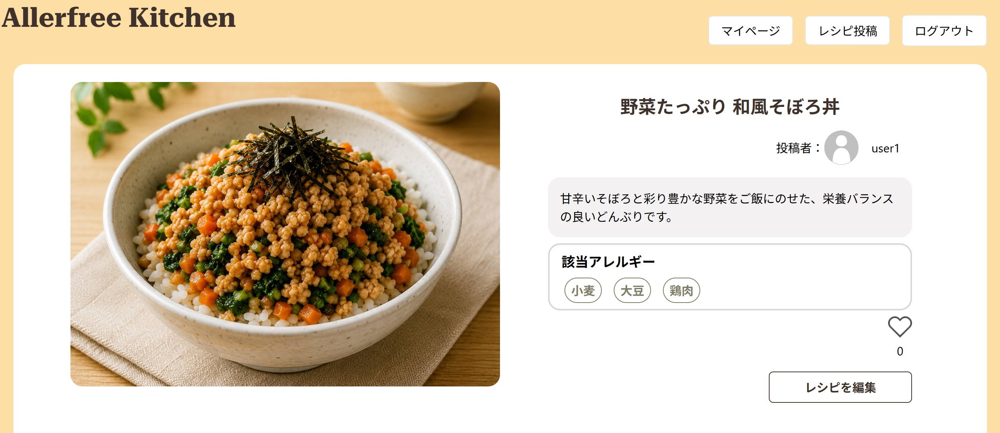
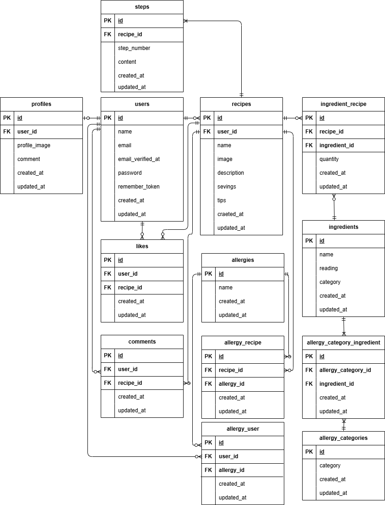
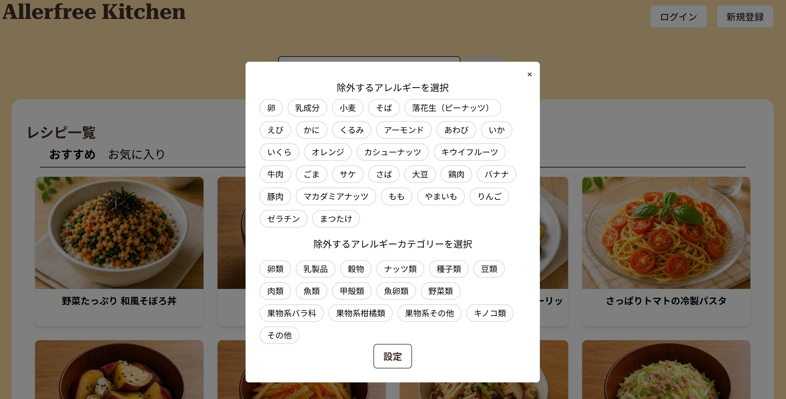

# Allerfree Kitchen
食物アレルギーを持つ子供を育てる親御さん向けのレシピ投稿・検索プラットフォーム




## 目次
- [アプリ概要](#アプリ概要)
- [本サービスが解決する課題](#本サービスが解決する課題)
- [今後の展開（Phase2）](#今後の展開phase2)
- [使用技術](#使用技術)
- [ER図](#er-図)
- [機能一覧](#機能一覧)
- [環境構築](#環境構築)
- [デプロイ](#デプロイ)
- [テスト](#テスト)

## アプリ概要
### 背景
食物アレルギーを持つ子供は増加傾向にあり、安全な食事管理は保護者にとって大きな課題である。

### 概要
本アプリは、食物アレルギーを持つ子供を育てる親御さん向けに特化したレシピ投稿・検索プラットフォームである。<br>
レシピ投稿時にアレルギー品目を明示的にタグ付けすることで、ユーザーが特定のアレルギー品目を含まないレシピを安全に検索・発見できる仕組みを提供する。

### 目的
アレルギー品目をファーストクラスの検索条件として扱うことで、保護者の負担を減らし、安心して使えるレシピ検索体験を提供することを目的とする。

## 本サービスが解決する課題
既存のアレルギー対応レシピサイトの多くは、専門家監修のレシピを一方的に提供する形式であり、<br>
ユーザー投稿・コメント機能を持たないため、実際の家庭での試行錯誤が反映されにくいという課題がある。
<br>
「誰の」：食物アレルギーを持つ子供の親御さん<br>
「何を」：安全なアレルギー対応レシピを探す手間と不安<br>
「どう解決するか」：<br>
- 投稿時にアレルギー品目（食品表示法の28品目）の申告を必須にし、信頼性のある情報のみが検索対象となる仕組みを提供する
- 保護者が自身のレシピを気軽に投稿・共有できるユーザー投稿型の設計により、実体験に基づくレシピが継続的に増える
- コメント機能により、同じアレルギーに悩む保護者同士が代替食材や調理の工夫を共有できるコミュニティを形成する

## 今後の展開（Phase2）
- レシピ投稿を「申請 → 管理者承認 → 公開」のフローに変更し、正確なアレルギー情報を持つレシピのみが公開される仕組みを構築


## 使用技術
| 分類 | 技術 |
| --- | --- |
| バックエンド | PHP8.1+, Laravel 10.x, Laravel Fortify |
| フロントエンド | TailwindCSS v4（Vite統合） |
| データベース |  MySQL 8.4 |
| 画像ストレージ | Cloudinary |
| インフラ・デプロイ | Render(アプリ本体)、Aiven(MySQL) |
| 開発環境 | Docker, Laravel Sail, phpMyAdmin |
| 開発ツール | Laravel Pint（コード整形） |


## ER 図



## 機能一覧

- 除外したいアレルギー品目（食品表示法の28品目）を指定したレシピ検索
- レシピのお気に入り登録・管理
- アレルギー品目を明示したレシピ投稿
- レシピへのコメント投稿



## 環境構築

1. リポジトリをクローン

```bash
git clone git@github.com:mami-kbb/allerfree-kitchen.git
cd allerfree-kitchen
```

2. 環境変数ファイルを準備

```bash
cp .env.example .env
```

3. Sailのエイリアスを設定（未設定の場合）

- Zshの場合
```bash
echo "alias sail='[ -f sail ] && bash sail || bash vendor/bin/sail'" >> ~/.zshrc
exec $SHELL
```

- Bashの場合
```bash
echo "alias sail='[ -f sail ] && bash sail || bash vendor/bin/sail'" >> ~/.bashrc
exec $SHELL
```

4. Docker Desktopを起動しておく

5. プロジェクト直下で、以下のコマンドを実行

```bash
make init
```
make initは以下を自動で実行します。

```
init:
	sail up -d
	sail artisan key:generate
	sail artisan storage:link
	sail artisan migrate --seed
	sail npm install
	@make fresh
```

6. 動作確認
以下のURLにアクセスして起動を確認する。

| サービス | URL |
| --- | --- |
| アプリ本体 | http://localhost |
| phpMyAdmin | http://localhost:8080 |

### 7. フロントエンドの開発サーバーを起動
画面の表示を確認する場合は、別ターミナルで以下を実行する。
```bash
npm run dev
```
## デプロイ

### 公開URL
https://allerfree-kitchen.onrender.com

### デモアカウント
| 用途 | name | email | password | 備考 |
| --- | --- | --- | --- | --- |
| 管理者 | admin | admin@example.com | password | ※phase2で機能実装予定。 |
| 閲覧用(サンプル投稿者) | user1 | user1@example.com | password |  |
| 操作確認用(CRUDをお試しください) | user2 | user2@example.com | password |  |

### インフラ構成
| 役割 | サービス |
| --- | --- |
| アプリケーションサーバー | Render(Docker) |
| データベース | Aiven for MySQL |
| 画像ストレージ | Cloudinary |

### 補足
- 無料プランを使用しているため、しばらくアクセスがないとアプリの起動に30秒～1分ほどほどかかる場合があります。
- アップロードした画像はCloudinary上に保存されるため、サーバーの再起動後も消えません。

## テスト
Featureテストでは以下を検証しています。
- ユーザーの登録・ログイン・メール認証
- レシピ投稿・編集・削除
- レシピ名・材料名・アレルギー品目による検索・絞り込み
- お気に入り登録・解除

全テストを実行する場合
```bash
sail artisan test
```
特定のテストのみ実行する場合
```bash
sail artisan test --filter=SearchRecipesTest
```