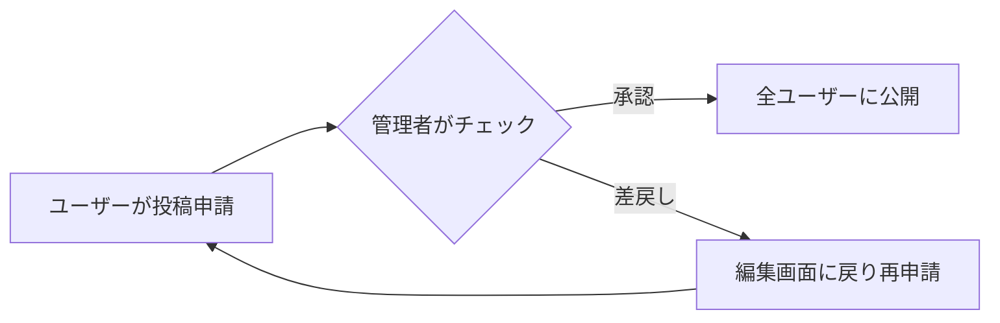

# Allerfree Kitchen
食物アレルギーを持つお子さんの保護者向けの、レシピ投稿・検索サービスです。「卵」「小麦」など、除外したいアレルギー品目を選んで、レシピを探せます。


### まず試してみる
公開URL：https://allerfree-kitchen-495692164278.asia-northeast1.run.app

| 使う人 | ログイン方法 | できること |
| --- | --- | --- |
| 一般ユーザー | ログイン画面の「デモユーザーでログイン」ボタンをクリック | レシピの検索・投稿・編集・お気に入り・コメント |
| 管理者 | ログイン画面の「管理者ログインはこちら」から　admin@example.com / password | 投稿レシピの承認・差戻し、食材の管理 |

- デモ専用の環境です。データはリセットされることがあります。
- しばらくアクセスがないと、最初の表示に30秒〜1分ほどかかることがあります。
- 新規登録しても、認証メールは届きません（理由は「デプロイ」の補足をご覧ください）。お試しの際は、デモユーザーでログインしてください。


## 目次
- [アプリ概要](#アプリ概要)
- [本サービスが解決する課題](#本サービスが解決する課題)
- [機能一覧](#機能一覧)
- [使用技術](#使用技術)
- [ER図](#er-図)
- [工夫した点と苦労した点](#工夫した点と苦労した点)
- [環境構築](#環境構築)
- [デプロイ](#デプロイ)
- [テスト](#テスト)
- [今後の展開](#今後の展開)


## アプリ概要

### 背景
食物アレルギーを持つお子さんは増加傾向にあり、毎日の食事選びは保護者にとって大きな負担です。

### 概要
食物アレルギーを持つお子さんを育てる保護者に向けた、レシピ投稿・検索サービスです。投稿者がレシピにアレルギーを品目を付け、管理者が確認してから公開します。利用者は、特定のアレルギー品目を含まないレシピを探せます。

>**ご利用にあたって**
>検索は、レシピに登録された材料と、確認済みのアレルギー品目をもとに行います。
>調味料や加工食品の原材料までは判断できません。必ず商品の表示をご確認ください。

### 目的
アレルギー品目を「検索条件の中心」に置くことで、レシピ探しの負担と不安を減らすことを目指しています。

## 本サービスが解決する課題
既存のアレルギー対応レシピサイトの多くは、専門家監修のレシピを一方的に載せる形式です。投稿やコメントの機能がないため、家庭での工夫や試行錯誤が反映されにくい、という課題があります。

- **誰の悩みか**：食物アレルギーを持つお子さんの保護者
- **何に困っているか**：安全に食べられるレシピを探す手間と不安
- **どう解決するか**
 - 投稿時にアレルギー品目（本アプリでは29品目から選択）の申告を必須にし、さらに管理者が承認したレシピだけを公開します。確認を2段階にすることで、情報の信頼性を高めます。
 - 保護者が自分のレシピを気軽に投稿できるので、実体験に基づくレシピが増えていきます。
 - コメント機能で、同じ悩みを持つ保護者通同士が、代わりの食材や調理の工夫を共有できます。


## 機能一覧
- 除外したいアレルギー品目（29品目）を指定したレシピ検索
- レシピのお気に入り登録・管理
- アレルギー品目を明示したレシピ投稿
- レシピへのコメント投稿
- 管理者による食材管理
- 管理者によるレシピ投稿の承認・差戻し


### レシピ投稿の承認フロー
アレルギー情報の信頼性を保つため、投稿レシピは次の流れで公開されます。


```mermaid
flowchart LR
	A[ユーザーが投稿申請] --> B{管理者がチェック}
	B -->|承認| C[全ユーザーに公開]
	B -->|差戻し| D[編集画面に戻り再申請]
	D --> A
```


## 使用技術
| 分類 | 技術 |
| --- | --- |
| バックエンド | PHP8.3, Laravel 10.x, Laravel Fortify |
| フロントエンド | TailwindCSS v4（Vite統合） |
| データベース |  MySQL 8.4（本番は TiDB Cloud Starter、MySQL 互換） |
| 画像ストレージ | Cloudinary |
| メール送信 | Resend |
| インフラ・デプロイ | Cloud Run(アプリ本体)、TiDB Cloud Starter(DB) |
| 開発環境 | Docker, Laravel Sail, phpMyAdmin |
| 開発ツール | Laravel Pint（コード整形） |

## ER 図


## 工夫した点と苦労した点

### 工夫した点
**1. アレルギー情報の信頼性を、2段階で担保する仕組み**
	- 投稿時にアレルギー申告を必須にしている。
	- 申請ルートを導入し、管理者が食材をもとに指定したアレルギーの整合性を確認し、食材マスタが未設定の食材が残っていると承認できない仕組みにした。

**2. 検索ロジックの設計**
	- スコープを機能ごとに分割した（キーワード・除外食材・除外アレルギー・除外カテゴリー）。
	- `whereDoesntHave`を使い、条件を組み合わせて絞り込めるようにしている。

**3. 画像アップロードの一貫性**
	- DB トランザクションと Cloudinary へのアップロードを組み合わせている。
	- 失敗時は、アップロード済みの画像を削除して孤児ファイルを残さないようにした。
	- 更新時は、保存成功後に古い画像を削除している。

### 苦労した点
**1. デプロイでのローディング速度問題**
	- アプリをRender、データベースをAivenで運用していたが、リージョンが離れていたためページ表示に時間がかかっていた。  
	それぞれCloud Run(アプリ本体)、TiDB Cloud Starter(MySQL)に変更することで、問題を解決した。  
	初回表示時 約4秒 → 約1秒

**2. ページ送りで同じレシピが全ページに出る問題**
	- 原因は、created_at が同一で並び順が不安定だった。  
	orderByDesc('id') を追加して解決した。

**3. メール認証を本番で動かす際、Resend の無料枠の制約で送信できない問題**
	- 送信失敗時にドメイン未認証のResendは、自分のアカウントのメールアドレス宛にしか送れず、例外になり500が返っていた。
	- リスナーを作成することで、送信失敗でも登録が 500 にならないようにした。
	- 本番のメール認証には独自のドメインでの送信元認証が必要だと学んだ。
	- デモログインで代替している。


## 環境構築

1. リポジトリをクローン

```bash
git clone git@github.com:mami-kbb/allerfree-kitchen.git
cd allerfree-kitchen
```

2. 環境変数ファイルを準備

```bash
cp .env.example .env
```

3. Sailのエイリアスを設定（未設定の場合）

- Zshの場合
```bash
echo "alias sail='[ -f sail ] && bash sail || bash vendor/bin/sail'" >> ~/.zshrc
exec $SHELL
```

- Bashの場合
```bash
echo "alias sail='[ -f sail ] && bash sail || bash vendor/bin/sail'" >> ~/.bashrc
exec $SHELL
```

4. Docker Desktopを起動しておく

5. プロジェクト直下で、以下のコマンドを実行

```bash
make init
```
※ `make`コマンドが使えない場合は、`sudo apt install make`(Ubuntu/WSL)または`brew install make`(Mac)でインストールしてください。<br>

make initは以下を自動で実行します。

```
init:
	sail up -d
	sail artisan key:generate
	sail artisan storage:link
	sail artisan migrate --seed
	sail npm install
	@make fresh
```

6. 動作確認
以下のURLにアクセスして起動を確認する。

| サービス | URL |
| --- | --- |
| アプリ本体 | http://localhost |
| phpMyAdmin | http://localhost:8080 |

### 7. フロントエンドの開発サーバーを起動
画面の表示を確認する場合は、別ターミナルで以下を実行する。
```bash
npm run dev
```
## デプロイ

### 公開URL
https://allerfree-kitchen-495692164278.asia-northeast1.run.app

### デモアカウント
| 用途 | name | email | password | 備考 |
| --- | --- | --- | --- | --- |
| 管理者 | admin | admin@example.com | password | レシピ投稿の承認・差戻しを行う管理者アカウント。ログイン画面の「管理者ログインはこちら」から入ります |
| 閲覧用(サンプル投稿者) | user1 | user1@example.com | password |  |
| 操作確認用(CRUDをお試しください) | user2 | user2@example.com | password | ログイン画面の「デモユーザーでログイン」ボタンからワンクリックで入れます |

※デモ専用のアカウントです。データはリセットされることがあります。

### インフラ構成
| 役割 | サービス |
| --- | --- |
| アプリケーションサーバー | Cloud Run |
| データベース | TiDB Cloud Starter |
| 画像ストレージ | Cloudinary |
| メール送信 | Resend |

### 補足
- Cloud Run のスケールゼロおよびTiDB Cloud Starterの起動により、しばらくアクセスがないとアプリの起動に30秒～1分ほどかかる場合があります。
- アップロードした画像はCloudinary上に保存されるため、サーバーの再起動後も消えません。
- 新規登録機能自体は実装されていますが、メール送信サービス(Resend)の無料プラン制限により、登録後のメール認証が完了ができません(認証メールが届くのは、Resend管理者のメールアドレスのみです)。
- そのため、一通りの機能(レシピ投稿・編集・お気に入りなど)をお試しになる場合は、ログイン画面の「デモユーザーからログイン」からログインを行ってください。

## テスト
Featureテストでは以下を検証しています(テスト実行時はメールの実送信を行わず、Laravel標準のテスト機能で検証しています)。
- ユーザーの登録・ログイン・メール認証
- 管理者のログイン
- レシピ申請・編集・削除
- レシピ名・材料名・アレルギー品目による検索・絞り込み
- お気に入り登録・解除
- 管理者のレシピ承認・差戻し

全テストを実行する場合
```bash
sail artisan test
```
特定のテストのみ実行する場合
```bash
sail artisan test --filter=SearchRecipesTest
```

## 今後の展開
- 通知機能（いいねやコメント通知、新着レシピ通知など）を導入し、ユーザーの継続利用を促す