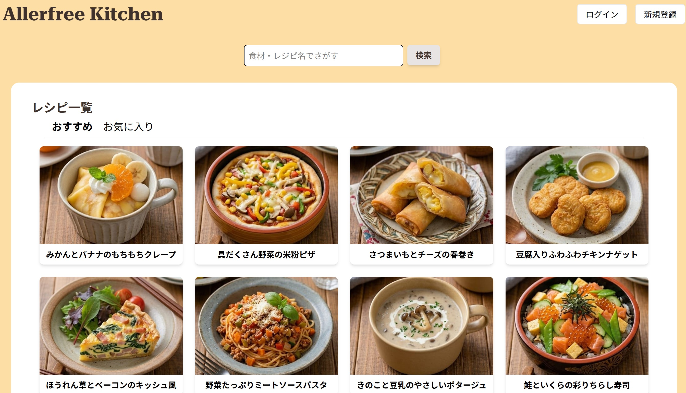
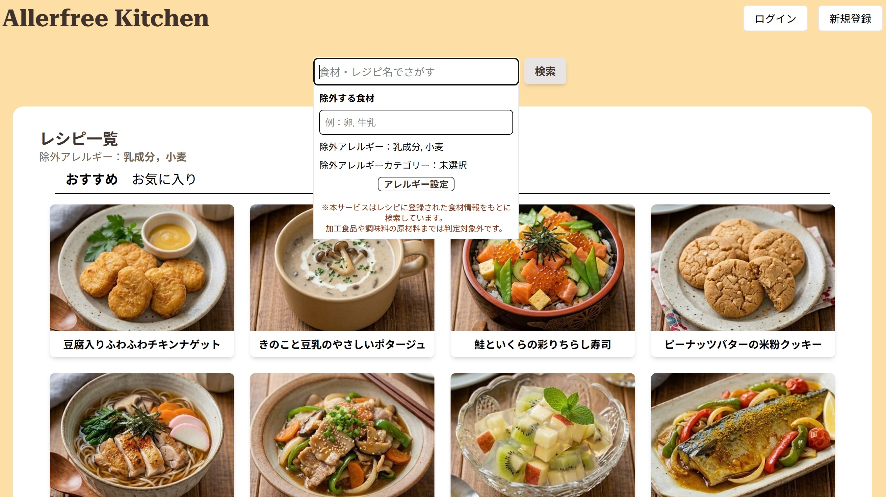
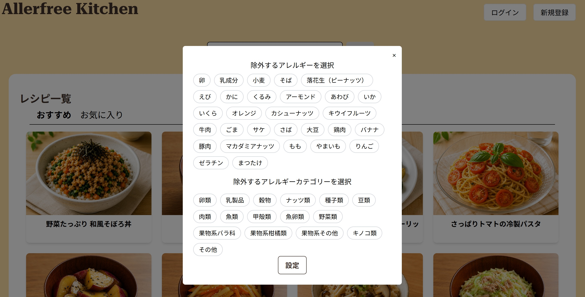
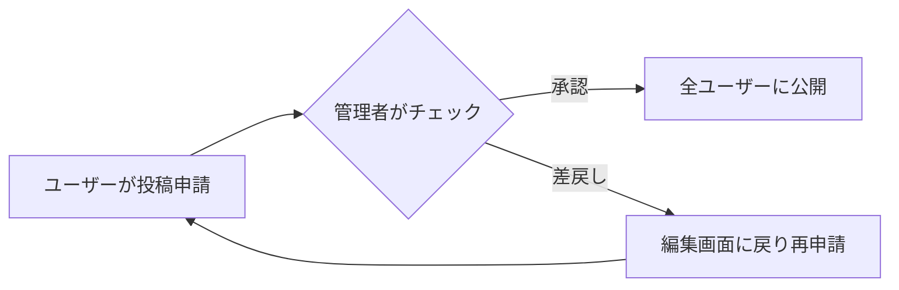
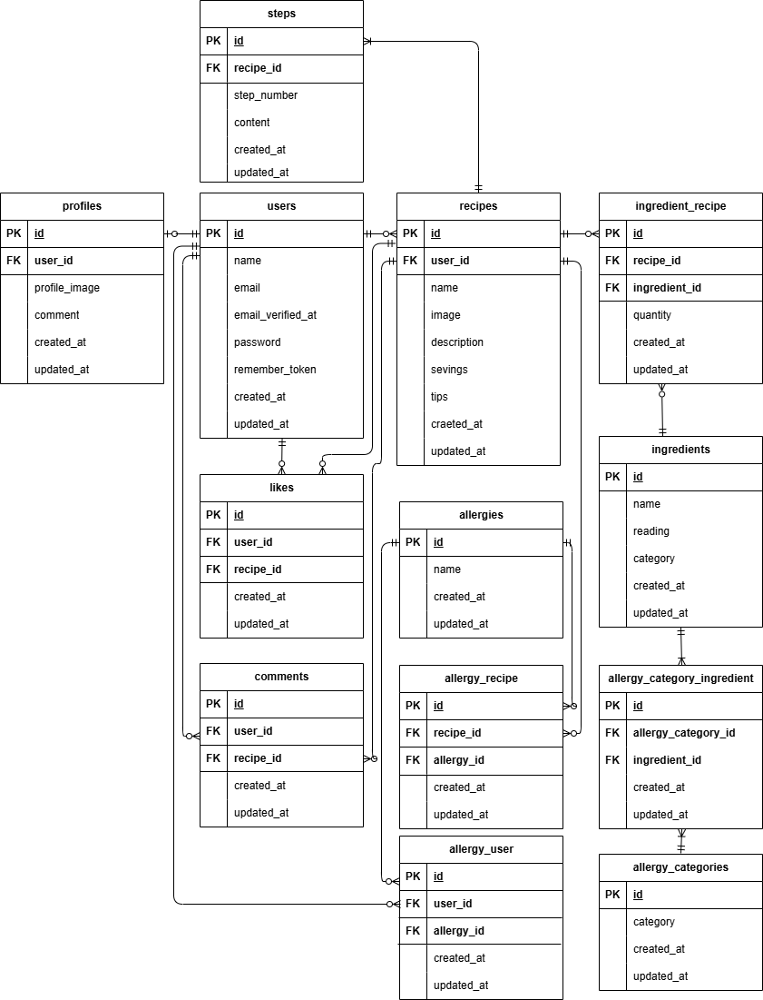

# Allerfree Kitchen
食物アレルギーを持つお子さんの保護者向けの、レシピ投稿・検索サービスです。「卵」「小麦」など、除外したいアレルギー品目を選んで、レシピを探せます。





### まず試してみる
公開URL：https://allerfree-kitchen-495692164278.asia-northeast1.run.app

| 使う人 | ログイン方法 | できること |
| --- | --- | --- |
| 一般ユーザー | ログイン画面の「デモユーザーでログイン」ボタンをクリック | レシピの検索・投稿・編集・お気に入り・コメント |
| 管理者 | ログイン画面の「管理者ログインはこちら」から<br>admin@example.com / password | 投稿レシピの承認・差戻し、食材の管理 |

- デモ専用の環境です。データはリセットされることがあります。
- しばらくアクセスがないと、最初の表示に30秒〜1分ほどかかることがあります。
- 新規登録しても、認証メールは届きません（理由は「デプロイ」の補足をご覧ください）。お試しの際は、デモユーザーでログインしてください。


## 目次
- [アプリ概要](#アプリ概要)
- [本サービスが解決する課題](#本サービスが解決する課題)
- [機能一覧](#機能一覧)
- [使用技術](#使用技術)
- [ER図](#er-図)
- [工夫した点と苦労した点](#工夫した点と苦労した点)
- [環境構築](#環境構築)
- [デプロイ](#デプロイ)
- [テスト](#テスト)
- [今後の展開](#今後の展開)


## アプリ概要

### 背景
食物アレルギーを持つお子さんは増加傾向にあり、毎日の食事選びは保護者にとって大きな負担です。

### 概要
食物アレルギーを持つお子さんを育てる保護者に向けた、レシピ投稿・検索サービスです。投稿者がレシピにアレルギー品目を付け、管理者が確認してから公開します。利用者は、特定のアレルギー品目を含まないレシピを探せます。

>**ご利用にあたって**
>
>検索は、レシピに登録された材料と、確認済みのアレルギー品目をもとに行います。
>調味料や加工食品の原材料までは判断できません。必ず商品の表示をご確認ください。

### 目的
アレルギー品目を「検索条件の中心」に置くことで、レシピ探しの負担と不安を減らすことを目指しています。

## 本サービスが解決する課題
既存のアレルギー対応レシピサイトの多くは、専門家監修のレシピを一方的に載せる形式です。投稿やコメントの機能がないため、家庭での工夫や試行錯誤が反映されにくい、という課題があります。

- **誰の悩みか**：食物アレルギーを持つお子さんの保護者
- **何に困っているか**：安全に食べられるレシピを探す手間と不安
- **どう解決するか**
  - 投稿時にアレルギー品目（本アプリでは29品目から選択）の申告を必須にし、さらに管理者が承認したレシピだけを公開します。確認を2段階にすることで、情報の信頼性を高めます。
  - 保護者が自分のレシピを気軽に投稿できるので、実体験に基づくレシピが増えていきます。
  - コメント機能で、同じ悩みを持つ保護者同士が、代わりの食材や調理の工夫を共有できます。


## 機能一覧
- 除外したいアレルギー品目（29品目）を指定したレシピ検索
- レシピのお気に入り登録・管理
- アレルギー品目を明示したレシピ投稿
- レシピへのコメント投稿
- 管理者による食材管理
- 管理者によるレシピ投稿の承認・差戻し

### レシピ投稿の承認フロー
アレルギー情報の信頼性を保つため、投稿レシピは次の流れで公開されます。


```mermaid
flowchart LR
	A[ユーザーが投稿申請] --> B{管理者がチェック}
	B -->|承認| C[全ユーザーに公開]
	B -->|差戻し| D[編集画面に戻り再申請]
	D --> A
```


## 使用技術
| 分類 | 技術 |
| --- | --- |
| バックエンド | PHP8.3, Laravel 10.x, Laravel Fortify |
| フロントエンド | TailwindCSS v4（Vite統合） |
| データベース |  MySQL 8.4（本番は TiDB Cloud Starter、MySQL 互換） |
| 画像ストレージ | Cloudinary |
| メール送信 | Resend |
| インフラ・デプロイ | Cloud Run(アプリ本体)、TiDB Cloud Starter(DB) |
| 開発環境 | Docker, Laravel Sail, phpMyAdmin |
| 開発ツール | Laravel Pint（コード整形） |
| アイコン | Heroicons |

## ER 図


## 工夫した点と苦労した点

### 工夫した点
**1. アレルギー情報を2段階で確認する仕組み**

- 投稿時にアレルギー申告を必須にしています。
- 管理者が、材料とアレルギー品目が合っているかを確認してから、公開します。
- 材料にアレルギーカテゴリーが未設定の食材が残っていると、承認できません。

**2. 検索条件を組み合わせられる設計**

- 「キーワード」「除外する食材」「除外するアレルギー」「除外するカテゴリー」を、それぞれ別の部品（スコープ）に分けました。
- 「含まないレシピだけ」を取り出すため、`whereDoesntHave`を使っています。

**3. 画像アップロードに失敗したときの後始末**

- レシピの保存と画像のアップロードを、ひとまとまりで扱っています。
- 失敗時は、アップロード済みの画像を削除し、使われない画像が残らないようにしています。

### 苦労した点
**1. ページの表示が遅い**

- 原因：アプリをRender、データベースをAivenで運用していましたが、2つのサーバーの場所が離れていました。
- 対応：アプリを Cloud Run、データベースを TiDB Cloud Starter に移しました。
- 結果：初回表示時が約4秒から約1秒になりました。

**2. 同じレシピが、ページをまたいで何度も出てくる**

- 原因：同じ作成日時のレシピがたくさんあり、並び順が毎回同じになるとは限りませんでした。
- 対応：並び順の最後に id を加えて、順番が必ず1つに決まるようにしました。

**3. 新規登録のあとに500エラーが出る**

- 原因：Resend の無料枠では、ドメインを認証していない場合、自分のアカウントのメールアドレス宛にしか送れません。送信に失敗して例外になり、500エラーが返っていました。
- 対応：メール送信に失敗しても、登録は成功させ、失敗はログに残すようにしました。
- 学び：本番でメール認証を動かすには、独自ドメインでの送信元認証が必要です。
- 現状：お試しの際は、デモユーザーでのログインをご利用ください。


## 環境構築

1. リポジトリをクローン

```bash
git clone git@github.com:mami-kbb/allerfree-kitchen.git
cd allerfree-kitchen
```

2. 環境変数ファイルを準備

```bash
cp .env.example .env
```

画像のアップロードには Cloudinary の接続情報（`CLOUDINARY_URL` など）が必要です。`.env` に設定してください。未設定の場合、画像のアップロードは動作しません。 メール送信（Resend）の設定は、`.env.example` を参照してください。

3. Sailのエイリアスを設定（未設定の場合）

- Zshの場合
```bash
echo "alias sail='[ -f sail ] && bash sail || bash vendor/bin/sail'" >> ~/.zshrc
exec $SHELL
```

- Bashの場合
```bash
echo "alias sail='[ -f sail ] && bash sail || bash vendor/bin/sail'" >> ~/.bashrc
exec $SHELL
```

4. Docker Desktopを起動しておく

5. プロジェクト直下で、以下のコマンドを実行

```bash
make init
```
※ `make`コマンドが使えない場合は、`sudo apt install make`(Ubuntu/WSL)または`brew install make`(Mac)でインストールしてください。

`make init` は、以下を自動で実行します（詳細は `Makefile` を参照）。

1. Docker で `composer install`（PHPの依存パッケージのインストール）
2. Sail（Docker）の起動と、MySQLの起動待ち
3. アプリキーの生成、ストレージのリンク作成
4. マイグレーションとサンプルデータの投入
5. `npm install`、`make fresh`（フロントエンドのビルド）

6. 動作確認
以下のURLにアクセスして起動を確認する。

| サービス | URL |
| --- | --- |
| アプリ本体 | http://localhost |
| phpMyAdmin | http://localhost:8080 |

7. フロントエンドの開発サーバーを起動
画面の表示を確認する場合は、別ターミナルで以下を実行する。
```bash
npm run dev
```
## デプロイ

### インフラ構成
| 役割 | サービス |
| --- | --- |
| アプリケーションサーバー | Cloud Run |
| データベース | TiDB Cloud Starter |
| 画像ストレージ | Cloudinary |
| メール送信 | Resend |

### 補足
- アクセスがないとサーバーが止まる仕組み（Cloud Run のスケールゼロ）や、TiDB Cloud Starter の起動待ちのため、しばらくアクセスがないと、最初の表示に30秒〜1分ほどかかることがあります。
- アップロードした画像はCloudinary上に保存されるため、サーバーの再起動後も消えません。
- 新規登録の機能は実装していますが、メール送信サービス（Resend）の無料枠の制限により、登録後のメール認証は完了できません（認証メールが届くのは、Resend のアカウント所有者のメールアドレスだけです）。
- そのため、一通りの機能(レシピ投稿・編集・お気に入りなど)をお試しになる場合は、ログイン画面の「デモユーザーでログイン」をご利用ください。

## テスト
Featureテストで、以下を確認しています（テスト中はメールを実際には送らず、Laravel標準の機能で確認しています）。
- ユーザーの登録・ログイン・メール認証
- 管理者のログイン
- レシピ申請・編集・削除
- レシピ名・材料名・アレルギー品目による検索・絞り込み
- お気に入り登録・解除
- 管理者のレシピ承認・差戻し

全テストを実行する場合
```bash
sail artisan test
```
特定のテストのみ実行する場合
```bash
sail artisan test --filter=SearchRecipesTest
```

## 今後の展開
- 通知機能（いいねやコメント通知、新着レシピ通知など）を追加し、継続して使ってもらえるようにする
- レシピ投稿時に、材料から「アレルギー品目の候補」を自動で提案し、付け忘れや間違いを減らす
- 独自ドメインを取得し、メール認証を本番環境でも動かす
